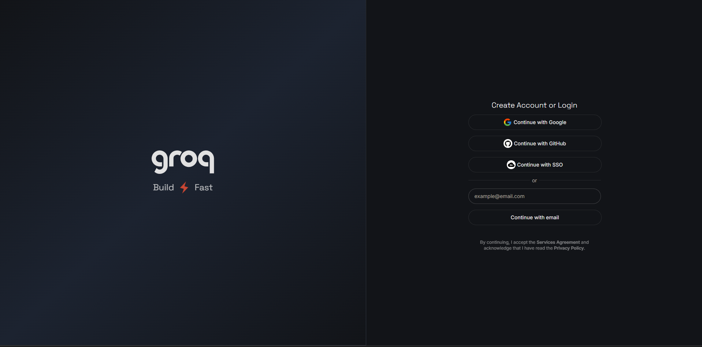
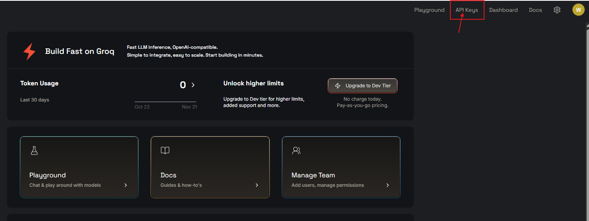
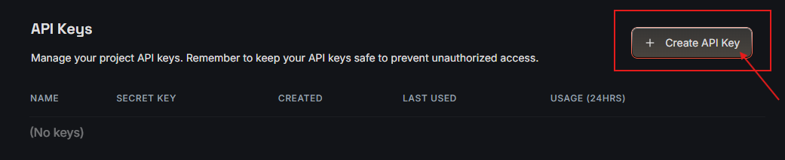
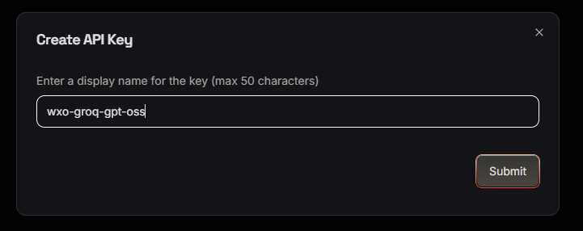
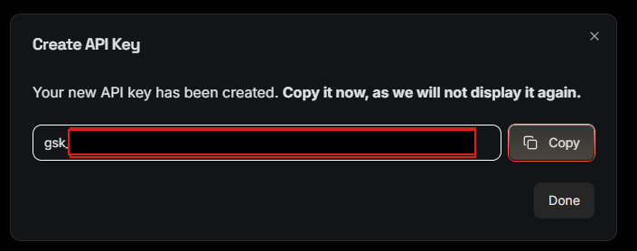
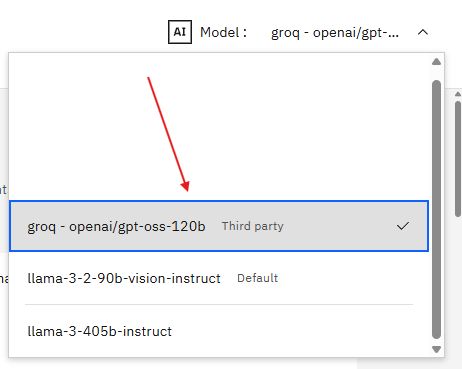

# LAB 2: AI Gateway

This lab demonstate how to import other models via Ai Gateway. We will import using **groq** api key 

### 0. Get Groq API Key
Register Groq account on this website *https://console.groq.com/login*



Select **API Keys** at top navigation bar or use this link *https://console.groq.com/keys*



Click **Create API Key** and name the key : ***wxo-groq-gpt-oss*** then click **Submit**




Store your key in safe place


### 1. import model

1. create `.env` file in **groq folder**.
2. Paste the content from the `env-tamplete` file, and fill in with required keys which you retrieve from last step 

### Adding model to watsonx.Orchestrate instance
3. run the following command in folder. 

if you have not setup orchestrate environment, run
```
orchestrate env add -n trial-env -u <your-WXO_URL>
```
then activate the environment by run
```
orchestrate env activate trial-env
```
After run the second command, you will be prompt to input your `WATSONX_API_KEY` you obtain earlier.

After that, run command below to setup model connection


```
bash setup_connection.sh
```
Then, run the following command to add model
```
bash add_model.sh
```
4. the model should now show up on your instance


