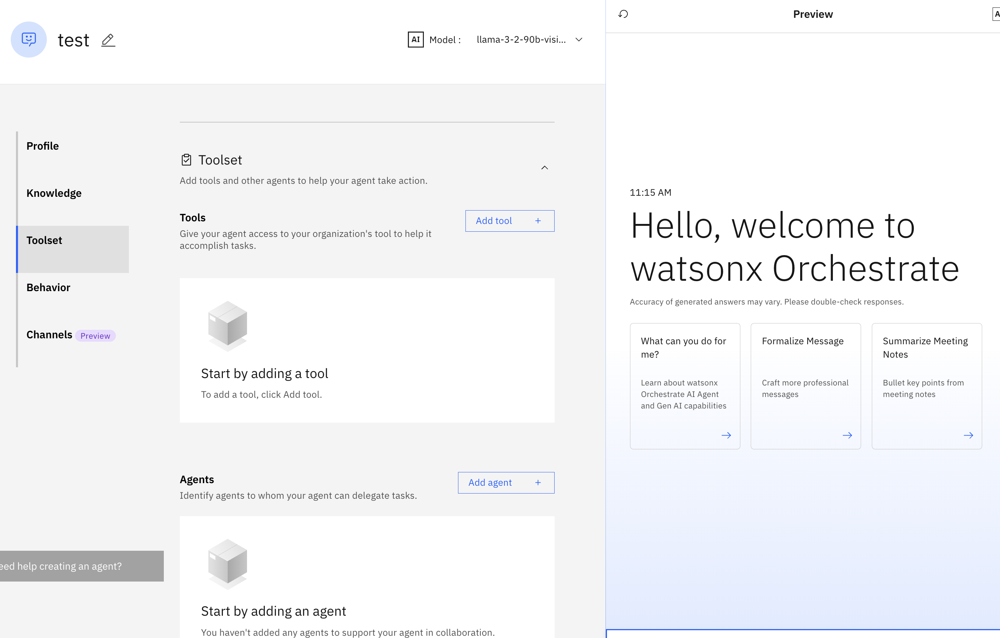
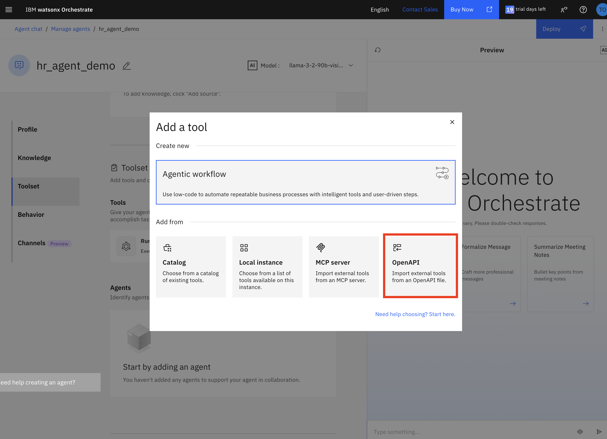
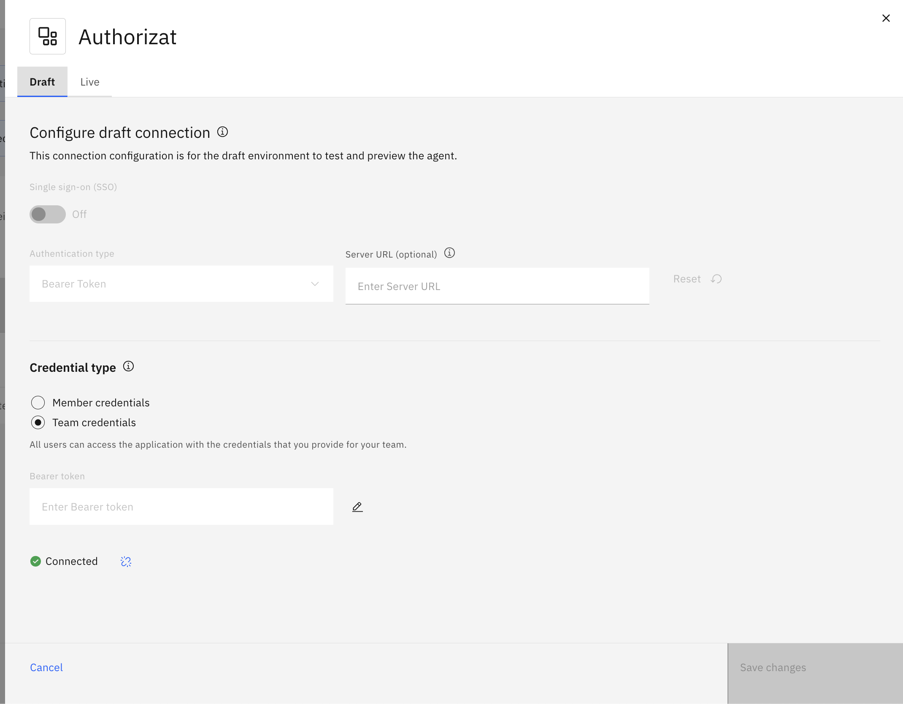
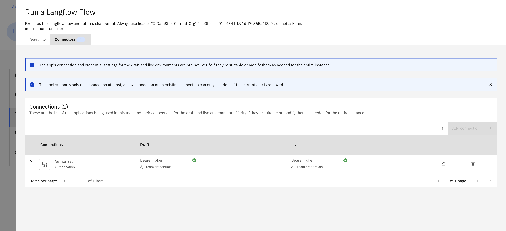
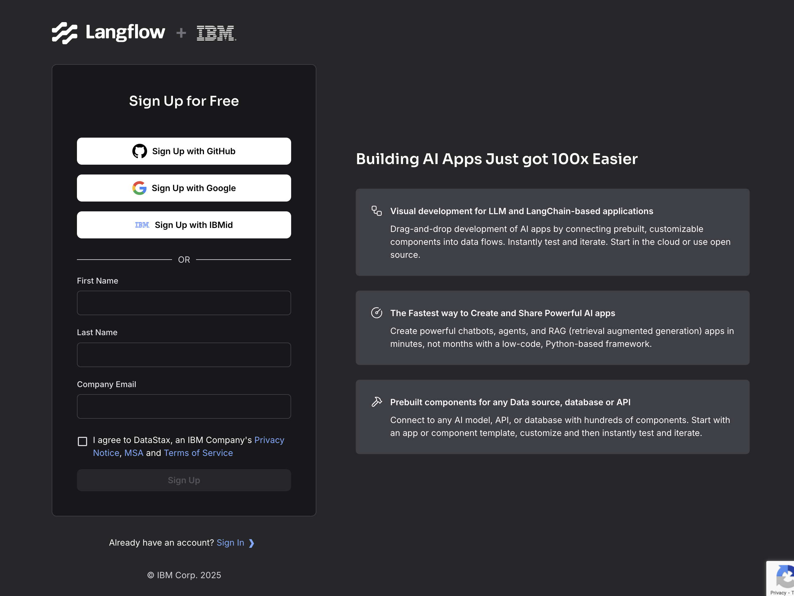
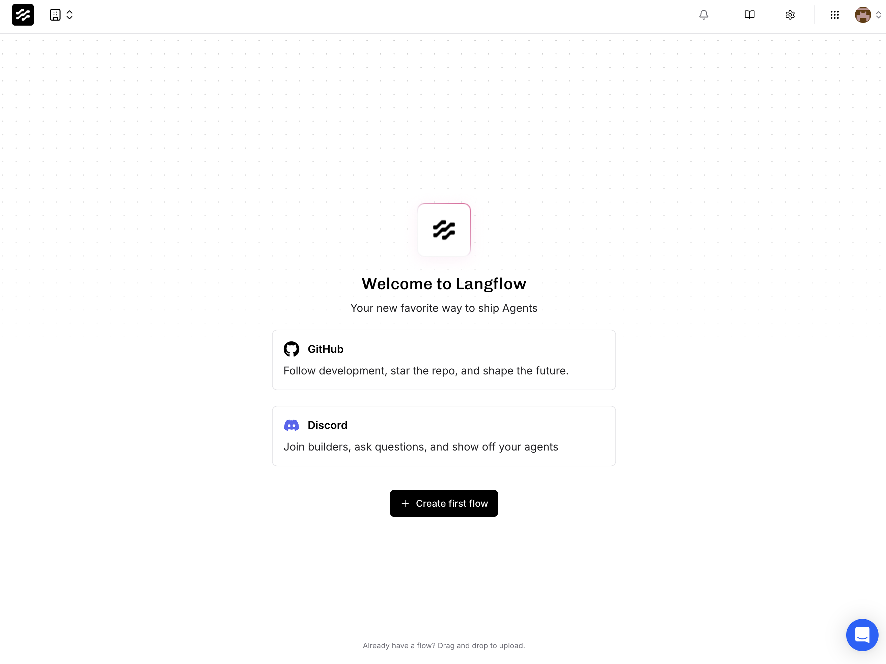
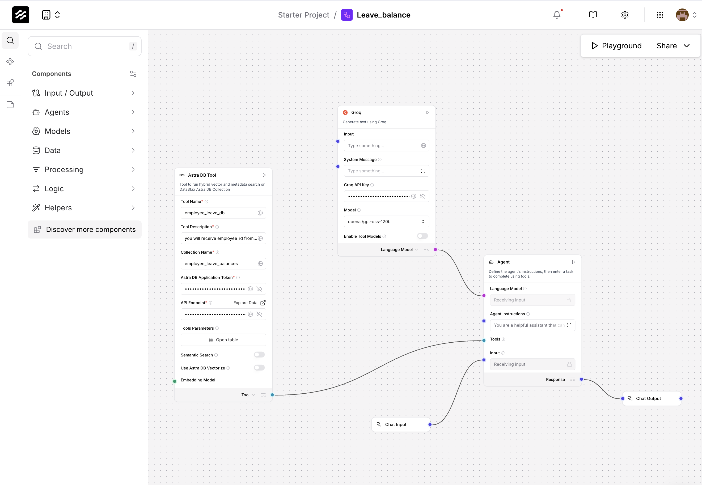

in this lab we are going to import leave management agent from langflow which connect to the Astra db

first, we will connect to the Langflow agent using OpenAPI


## STEPS
1. Open watsonx Oreschestrate `Agent Builder` page
2. Srcoll down to `Tools` session


3. select OpenAPI tools


4. choose the `openapi_spec.ymal` file in this folder


5. create new connection name `Authorization`, choose tye `Barear Token`



for value, put in the code recieved through your email. It should be something like
```
Bearer AstraCS:YoZm...
```

6. use the following questions to test the agent
- give me leave balance of EMP001
- give me leave balance of EMP002
- give me leave balance of EMP003

## Langflow
Now, after we have already connect the tools to Langflow, let's have a look in side the flow on what happened inside
1. Open a hosted Langflow service provided by DataStax iwth the fllowing link: [DataStax Langflow](https://astra.datastax.com/signup?type=langflow)

2. Sign up and Sign in to Langflow, you will land on the following page

3. Drag and Drop file `Langflow/Leave_balance.json` to the page directly. You will now have Leave balance as one of your flow.

4. Click in the flow. Here, you can observe how this leave balance tool works.


Component of the flow includes:
- Groq AI model gateway
- AstraDB tool connecting to external database
- Agent with prompt instruction
- Chat input 
- Chat output

### Langlfow API
The API tool you used to connect to Watsonx Orchestrate agent is provided from the prebuilt Langflow flow on cloud. However, if you want to adjust the flow tool and use your own API, you can access them here:


